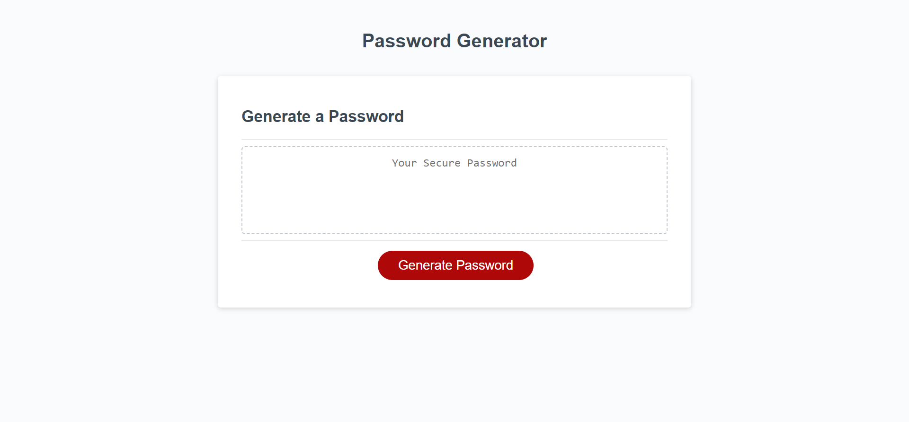
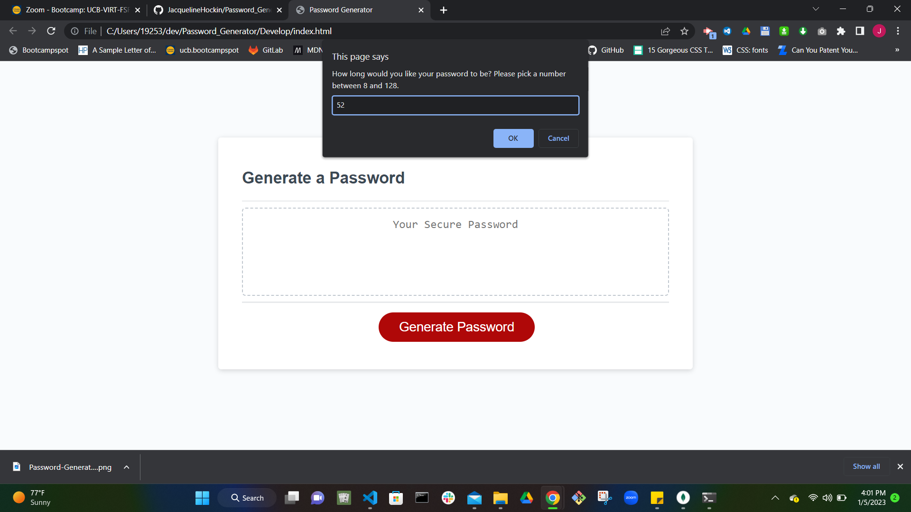
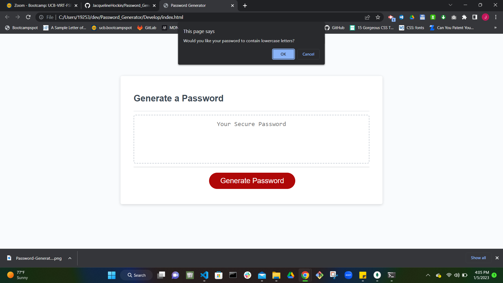
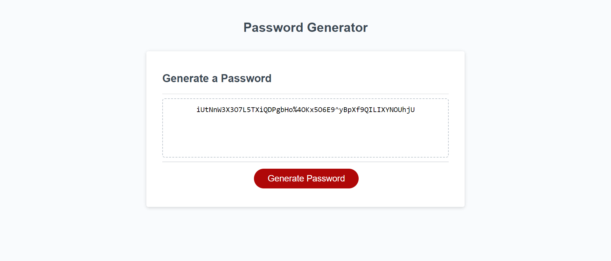

# Password_Generator

## Description

I was given HTML, CSS, and JavaScript starter code for a random password generator layout. I used and added to the starter JavaScript to get it working according to specific user criteria. Prompts were created asking if the user would like uppercase, lowercase, numbers, and special characters in their password. Based on the users' prompt responses, a random password is generated using a function I created.

### Links

Deployed Site URL: [https://jacquelinehockin.github.io/Password_Generator/]

#### Screenshot

